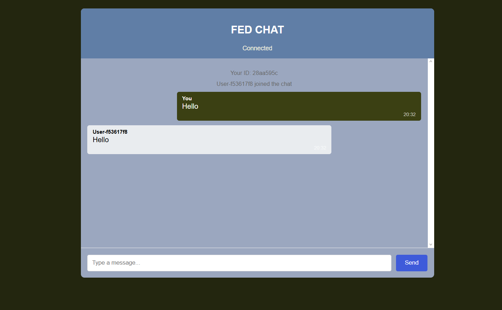

# WebSocket-Chat-Application
A real-time chat implementation using WebSocket protocol, designed to demonstrate core networking concepts.

**Features**:  
✔ Instant messaging via WebSocket  
✔ User presence notifications  
✔ Simple JavaScript implementation  

##  Key Learnings

### Network Fundamentals
- Established **WebSocket** connections between server and multiple clients
- Implemented **JSON message protocol** for event types (chat, presence, system)
- Managed socket lifecycle events (`onopen`, `onmessage`, `onclose`, `onerror`)

### Architectural Insights
- Built **centralized messaging** architecture
- Developed **user presence tracking** (join/leave notifications)
- Implemented **immediate message display** on client-side before server confirmation

### Deployment Skills
- Configured **Node.js WebSocket server** on Render
- Deployed static frontend via **GitHub Pages** and **Cloudflare Pages**
- Handled **WebSocket security** through connection validation
  
[Link(If I didn't close it)](https://fed-chat.pages.dev/)  

[](https://fed-chat.pages.dev/)
## 🛠 Tech Stack
```bash
Frontend: Vanilla JavaScript
Backend: Node.js + WS (WebSocket)
Infra: Render (Backend) + GitHub Pages + (Currently)Cloudflare Pages(Frontend)